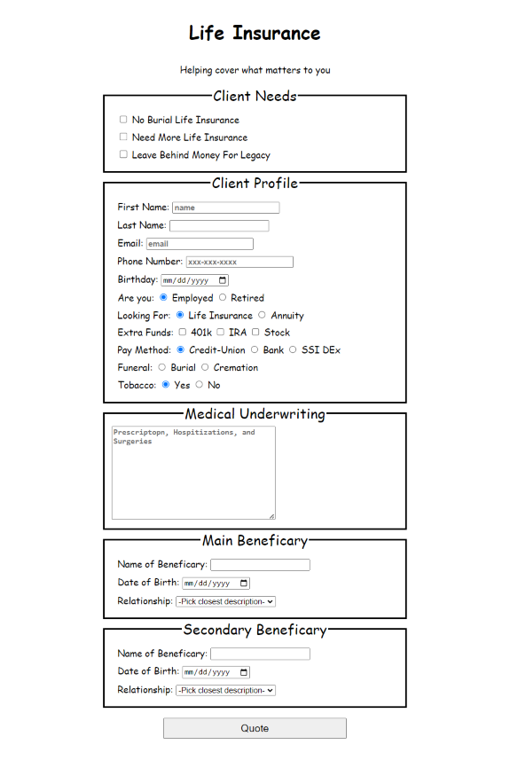

# freeCodeCamp > Responsive WebDesign > Survey Form

## Intro

This is the first project I completed on [freeCodeCamp](https://www.freecodecamp.org/).

Given my background in health and life insurance, I decided to transform one of the traditional forms I use into an online survey.

## Project

The objective was to utilize the [skills](https://www.freecodecamp.org/learn/2022/responsive-web-design/#learn-html-forms-by-building-a-registration-form) acquired in the preceding sections to design a survey.

To accomplish the project, there were [16 rules](https://www.freecodecamp.org/learn/2022/responsive-web-design/build-a-survey-form-project/build-a-survey-form) that had to be adhered to, and conducting tests helped identify which rules were successfully followed.

## Built with

- HTML & CSS

## What I learned 

Regarding HTML, I had the opportunity to acquaint myself with forms, fieldsets, labels, inputs, selects, and options. 

In terms of CSS, I gained a better understanding of controlling the appearance of my web application and became familiar with Web Developer Tools/Inspect. 

Additionally, I discovered the Chrome extension [GoFullPage](https://chromewebstore.google.com/detail/gofullpage-full-page-scre/fdpohaocaechififmbbbbbknoalclacl) during this process.

## Purpose

My objective is to showcase my past work while refining my proficiency with different tools. This includes getting acquainted with [Markdown](https://www.markdownguide.org/) and creating impactful README files. I'm determined to enhance my utilization of Git and GitHub, which will allow me to practice and acquire any skills I wish to master. The goal it to have existing code that I can modify and integrate various technologies with. 

In addition, I aim to refine my coding style to ensure it is as syntactically sound as possible.